# Files and Directories Commands

## Directory Path Commands

* `ls` get list directory contents
  * `ls -a` don't ignore hidden contents which starting with .
  * `ls -R` get list subdirectories recursively
  * `ls -l` get list directory contents with a long listing format
  * `ls <Directory>` specify directory which command execute on it
  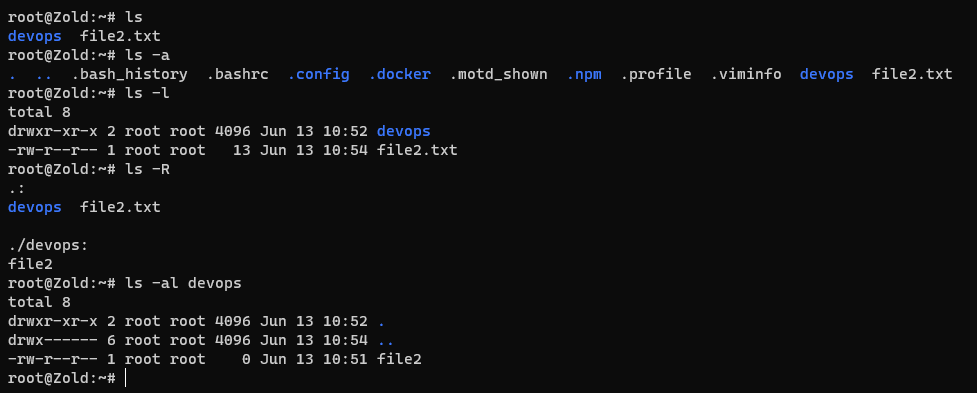
* `cd <Directory Path>` change the
* `pwd` print name of current/working directory
 working directory

***

## Directories Commands

The first thing you need to know is that: Directories in Linux = Folders in Windows

### New Directories

* `mkdir <Directory>` make directories
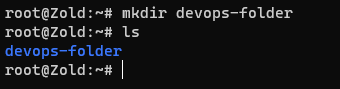
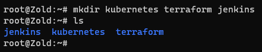
* `mkdir -p <Directory1>/<Directory2>` make nested directories, if they don't exist already.
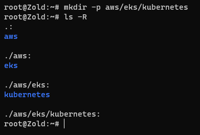

### Copy Directories

* `cp -r <Directory> <Path>` copy directories recursively
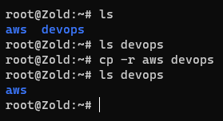

### Remove Directories

* `rmdir <Directory>` or `rm -d <Directory>` remove empty directories
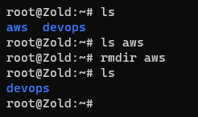
* `rm -r <Directory>` remove directories and their contents recursively
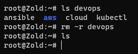
* `rm -rf **` remove all [directories, files, ...]
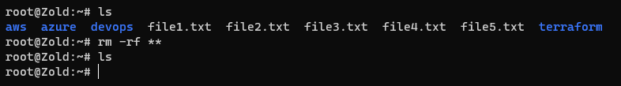

***

## Files Commands

### New Files

* `touch <File>` make files
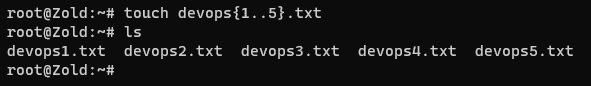

### Copy Files

* `cp <File> <Path>` copy file
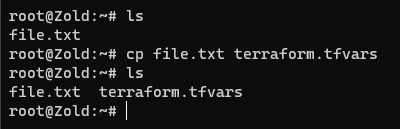

### Remove Files

* `rm <File>` remove files
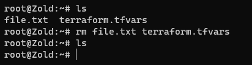

### Show Data of Files

* `cat <File>` concatenate files and print on the standard output
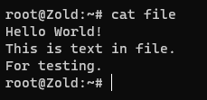
* `file <File>` determine file type
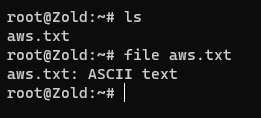

***

## Links

* `ln -s <File Path> <Link Name>` make links between files
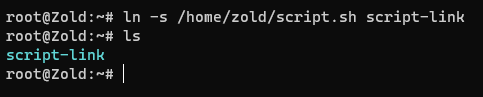
* `unlink <Link>` remove link
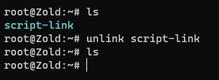

***

## Move/Rename

* `mv <Old File> <New File>` move (rename) [files, directories, ...]
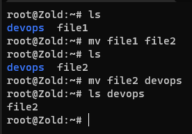